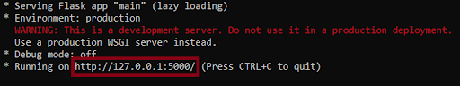
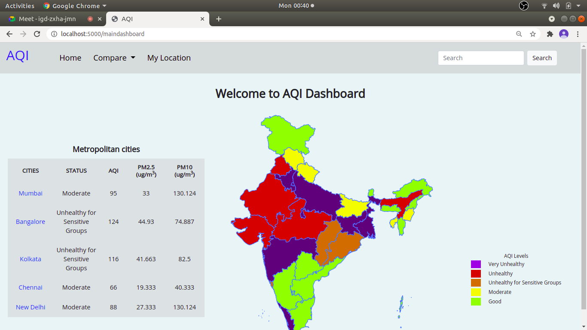

# AQI Watch

This is the repository for the course project of the course IT314 Software Engineering offered by DA-IICT and made under the guidance of Prof. Saurabh Tiwari. Our objective was to design a platform which collects toxic substance data and allows users easy access to their overall exposure levels of pollutants. Users can see the further breakdown of the quality of air around them through seamlessly integrated visualizations and other statistical data. This project will help people be more aware of the exposure they have to pollutants around them, and in turn help them make better decisions about which areas to avoid.

___

UI design on Figma can be found on the following link: https://www.figma.com/file/mDtimliSV5PkYJhoTcnSro/SEN?node-id=0%3A1

--- 

Important dependencies that need to be installed:
> pip install Flask
> 
> pip install Flask-Caching
> 
> pip install python-aqi
> 
> pip install requests
 
Before proceeding, please check the version of Python you are running with:
 
> python --version
 
If your python version is 2.x, then you need to install python3 or if you have already installed python3 then you need to make python3 your default Python version. This website runs only on python version 3.x

--- 
 
How to run the website on local host:
 
Follow these steps to clone this repository into your local machine and run the website in your local host.
 
1. Fork this main repository in your GitHub profile. This will create a copy of this repository in your own profile. For forking this repository click on the fork button on the top of this repository.
2. Clone this repository from your profile to your local machine. You should have installed git CLI in your system. Now, move to the required location in the terminal (if using Mac or Linux) or command prompt (if using Windows) and then type this command to clone.

> gh repo clone riddhitanna/AQI-Analytics-Dashboard-32
 
3. Now move into this repository by using the cd command in the terminal or command prompt. 
4. Now install all the dependencies as mentioned in the Important dependencies tab.
5. Now to run this website on local host use the following command in terminal or command prompt:
 
> python main.py

6. The terminal or command prompt output will look like this and the website will be hosted at the following URL:

 
7. Simply click on the URL or copy it in your Chrome browser and the website will be loaded and the front page will be displayed as follows:

 
---

The different functionalities of the website are shown in the link provided below:
 
Link of demo video

